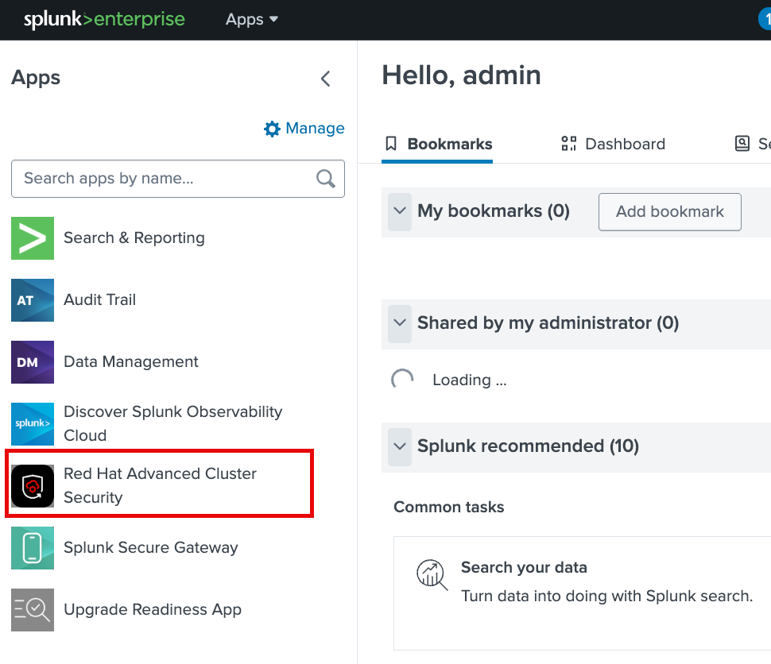
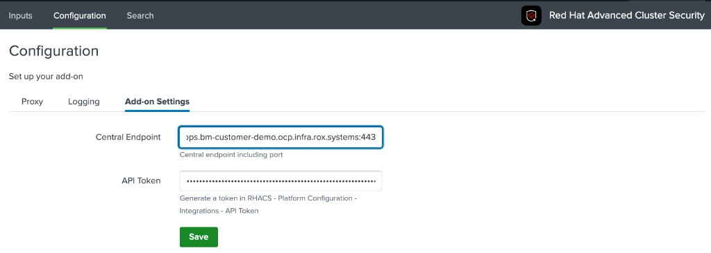
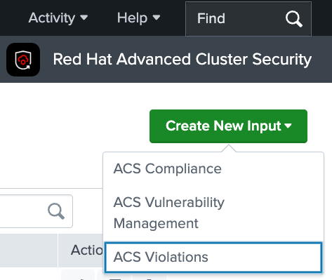
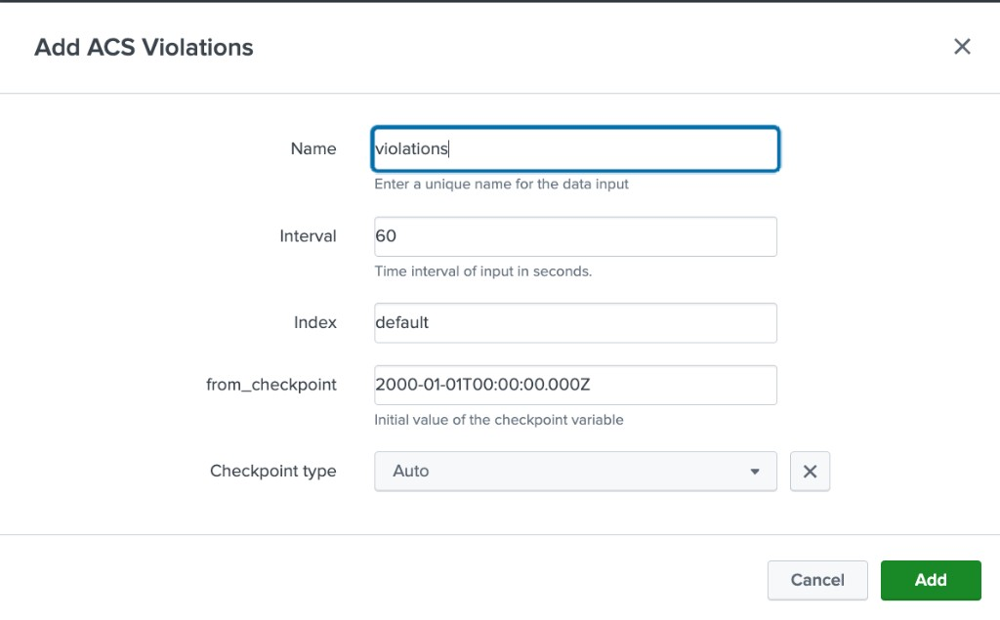

# RHACS Splunk TA demo (Cursor skill)

## What you build

This skill helps you stand up a **small Splunk Enterprise lab on OpenShift** and wire it to **Red Hat Advanced Cluster Security (RHACS / ACS)** using the official Splunkbase package ([app 5315](https://splunkbase.splunk.com/app/5315)).

There are **two** concrete outcomes:

1. **Splunk on the cluster** — Splunk Operator (Helm), a **Standalone** instance (Splunk Free), **PVCs**, and a **Route** to Splunk Web so people can log in with a browser.
2. **Red Hat Advanced Cluster Security in Splunk** — the Splunkbase **.tgz** is installed into Splunk; in the UI the add-on appears under **Apps** as **Red Hat Advanced Cluster Security**. You then point it at **RHACS Central** (hostname + port), paste an **API token**, and turn on the **Violations** input so events show up in search.

Everything here is for **learning and demos**, not a production hardening guide.

## Cluster requirements

- OpenShift cluster you may use for a **lab** (not production).
- **`cluster-admin`** for the identity you use with **`oc login`** (operator install uses cluster-scoped **CRDs**).
- **RHACS Central** already on the cluster and reachable the way your Splunk pods will need (often a public **Route**).

**Sizing and storage** (see **`REFERENCE.md`** Standalone manifest):

- **PVCs:** **10Gi** + **20Gi** ReadWriteOnce for Splunk **etc** / **var**; pick a **StorageClass** that provisions them (`oc get storageclass`).
- **Splunk pod:** about **500m–2** CPUs and **4–6Gi** memory in the reference example; leave headroom for the operator.

## Splunkbase add-on (prerequisite for “Install the TA for me”)

1. Log into [Splunkbase](https://splunkbase.splunk.com/app/5315) and download the **Red Hat Advanced Cluster Security** Splunk add-on as a **`.tgz`**.
2. On the **same machine where you run `oc`**, create **`~/code/Splunk/`** if it does not exist and **save the `.tgz` there** (keep Splunkbase’s filename, including any version suffix such as `_204`).
3. For the minimal **Install the TA for me** prompt, the skill assumes that layout: **one** Splunkbase add-on **`.tgz`** under **`~/code/Splunk/`**. If the file is missing, it lives outside that folder, or more than one **`.tgz`** there could be the wrong package, the agent asks once for the exact path.

This repository does not ship the **`.tgz`** (Splunkbase login and license terms apply).

## RHACS API token (before you configure the add-on)

The Splunk add-on calls **RHACS Central** over HTTPS with an **API token** (some UIs say “API key”).

1. Log into **RHACS Central** in a browser.
2. Create an API token from **Integrations → Authentication**. Name it (e.g. **`splunk-lab`**). Assign the **Analyst** role (the role must have **read** access).
3. **Copy the API key** when it is shown (Central will not show it again).

Paste the token only into **Splunk** in **Configuration → Add-on Settings** when you follow [**Getting started with Splunk using the TA**](#getting-started-with-splunk-using-the-ta) below (step **2**). You may share it with the agent in chat instead if you accept that risk—never commit it to git. Details: [Red Hat ACS — Integrating with Splunk](https://docs.openshift.com/acs/4.6/integration/integrate-with-splunk.html).

## What you need locally

- **Cursor** (Agent / skills)
- **`oc`** logged into the cluster
- **`helm`**

## Install this repository as a Cursor skill

1. Clone: [https://github.com/boazmichaely/rhacs-splunk-ta-demo-skill](https://github.com/boazmichaely/rhacs-splunk-ta-demo-skill)
2. Copy or symlink so **`SKILL.md`** and **`REFERENCE.md`** sit together under e.g. `~/.cursor/skills/rhacs-splunk-ta-demo-skill/`.
3. Restart Cursor (or reload the window).

## Agent flow

Say these **in order** in **Agent** chat. They are enough **when this skill is in scope** for the session (skill enabled for the project, `@` mention to the skill if your Cursor build supports it, or you already asked something Splunk/OpenShift–related so the agent loaded **`SKILL.md`**). The agent follows lab **defaults** from **`REFERENCE.md`**: namespace **`splunk-demo`**, Splunk pod **`splunk-lab-standalone-0`**, Standalone sizing and **Splunk Free**; it chooses **StorageClass** from **`oc get storageclass`** (typically the default) unless you overrode that earlier. Prompt **3** expects the Splunkbase **`.tgz`** under **`~/code/Splunk/`** as described above.

| # | Say | Outcome (defaults) |
|---|-----|--------------------|
| 1 | Run a preflight check. | Read-only **`oc` / helm** checks from **`REFERENCE.md`**—cluster version, nodes, default **StorageClass**, **SCCs** including **nonroot-v2**, and whether **CRDs** can be created. **Nothing is installed.** |
| 2 | Install Splunk for me. | **Splunk Operator** (Helm) + **Standalone** lab CR + **Route** (with **edge TLS** per the skill). You get **Splunk Web** URL and the **`oc`** line to read **admin** from **`splunk-lab-standalone-secret-v1`**. |
| 3 | Install the TA for me. | **`oc cp`** from **`~/code/Splunk/*.tgz`** (the Splunkbase add-on you placed there), then **`splunk install app`** and **`splunk restart`**. After restart, **Apps** lists **Red Hat Advanced Cluster Security**. |

Then use **Getting started with Splunk using the TA** below. Do not commit **tokens** or **passwords** to this repo.

## Getting started with Splunk using the TA

After **`splunk install app`** and a restart, complete the add-on in the Splunk browser (see **`SKILL.md`** for field nuances and verification).

### 1. Open the add-on

In **Splunk Web**, open **Apps** and select **Red Hat Advanced Cluster Security**.

### 2. Connect to RHACS Central (endpoint + API token)

1. In the add-on, open **Configuration** (top tabs).
2. Open **Add-on Settings** (sub-tab).
3. Set **Central endpoint** to your RHACS Central hostname **with port** (example pattern: `central-<route>.apps.<cluster-apps-domain>:443`, or the hostname your topology uses, plus **`:443`**). Use the form **host:port**; do not add **`https://`** unless the add-on’s help text tells you to—the add-on usually builds TLS when calling Central.
4. Paste the **API token** from RHACS (see **RHACS API token** above). Tokens are created under **Integrations → Authentication** in Central.
5. Click **Save**.

### 3. Create an input for each data source

1. Stay in the add-on and use **Create New Input** (green control with the drop-down).
2. Add **one modular input per type**: **ACS Compliance**, **ACS Vulnerability Management**, and **ACS Violations**—run the wizard separately for each so all three pipelines exist.

3. For each type, accept or adjust **interval**, **index**, and any checkpoint fields as needed for your lab. For **ACS Violations**, the lab defaults match **`SKILL.md`**: **interval** `60`, **index** `default`, **from_checkpoint** `2000-01-01T00:00:00.000Z`, **checkpoint type** **Auto** (example below).

### 4. Search and logs

Use **Search** in Splunk to confirm events (e.g. `index=default` or `index=*` with `sourcetype` filters for StackRox—see **`SKILL.md`**). If an input misbehaves, inspect TA logs on the Splunk pod under **`/opt/splunk/var/log/splunk/`** (commands in **`REFERENCE.md`**).

**Splunk UI vs app directory:** The UI shows **Red Hat Advanced Cluster Security**; on the Splunk instance files for this Splunkbase package live under **`/opt/splunk/etc/apps/TA-stackrox/`**. That directory name is normal for CLI paths and log filenames.

## Files in this repository

| File | Purpose |
|------|---------|
| **`SKILL.md`** | When the skill applies, full workflow, add-on UI fields, verification, guardrails. |
| **`REFERENCE.md`** | Copy-paste **`oc`** / **Helm** / Splunk CLI commands. |
| **`docs/splunk-apps-red-hat-advanced-cluster-security.png`** | Apps list with the add-on installed. |
| **`docs/ta-configuration-addon-settings.png`** | Configuration → Add-on Settings (Central + token). |
| **`docs/ta-create-new-input-menu.png`** | Create New Input menu (three input types). |
| **`docs/ta-add-acs-violations-input.png`** | Example **ACS Violations** input defaults. |

## References

- [Red Hat ACS — Integrating with Splunk](https://docs.openshift.com/acs/4.6/integration/integrate-with-splunk.html)
- [Splunk Operator for Kubernetes](https://splunk.github.io/splunk-operator/)
- [Splunkbase — Red Hat Advanced Cluster Security Splunk Technology Add-on](https://splunkbase.splunk.com/app/5315)

## Troubleshooting

**Splunk Web — Home and Edge Processor (Splunk 10):** **Home** can loop on an **Edge Processor** “First-time setup” page; **Cancel** may not clear it. This lab does **not** require Edge Processor. Open **Search & Reporting** directly:

`https://<your-splunk-route-host>/en-US/app/search/search`

or **Apps → Search & Reporting**. Optionally set **Settings → User preferences → Default application** to **Search & Reporting** so login skips the launcher.

**Add-on or inputs:** Use **`oc exec`** on **`splunk-lab-standalone-0`** and tail files under **`/opt/splunk/var/log/splunk/`** (see **`REFERENCE.md`**). For Central connectivity, re-check **Central endpoint** format and token scope in RHACS.
